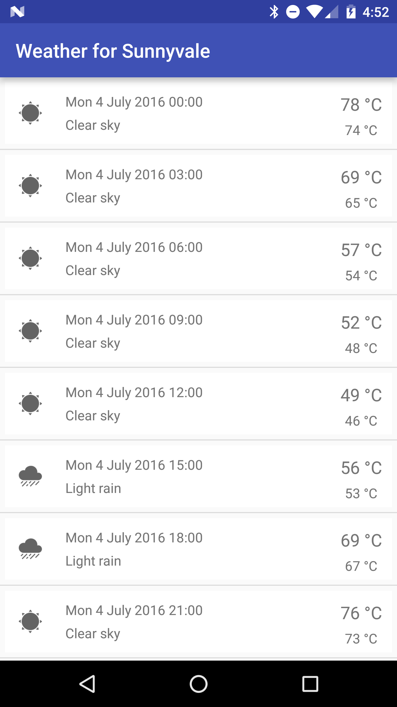
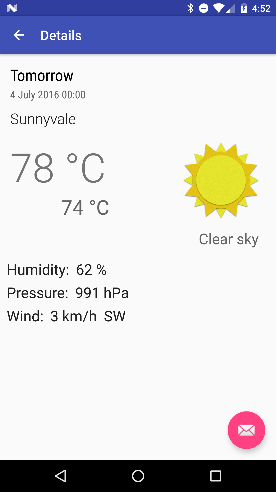

# weather-for-sunnyvale 

 

This is a fork of [WeatherforPoznan](http://www.github.com/piotrek1543/WeatherforPoznan) for Espresso testing examples for the following targets:
 - android-24
 - android-23
 - android-22
 - android-21
 - android-19
 - android-18
 - android-17
 - android-16

## About
Weather app that uses:
 - OpenWeatherMap API
 - Retrofit
 - Gson
 - AndroidAnnotations
 - ActiveAndroid 

Tested with:
 - JUnit and Robolectric
 - Automated UI tests written in Espresso

## Screenshots

